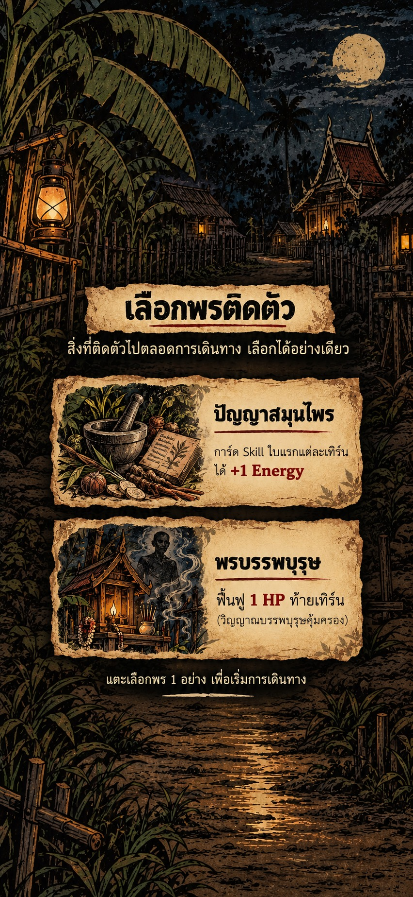

# Backlog: หน้าเลือกพรติดตัว — แบบกระชับที่อนุมัติ

สถานะ: อนุมัติ mockup และเก็บไว้ทำภายหลัง ยังไม่เริ่มแก้โค้ด
อนุมัติ: 5 ตุลาคม 2026 เวลา 16:39 น. (Asia/Bangkok)
โปรเจกต์: PhiKinHuaV6
ภาพที่เลือก: แบบปรับให้กระชับล่าสุด ไม่ใช่แบบแรกที่หัวข้อและใบพรใหญ่เกินไป

## แนวทางสำหรับ implementation

- คงฉากหมู่บ้านกลางคืน ต้นกล้วย แสงตะเกียง และดวงจันทร์ในสไตล์การ์ตูนผีไทยเล่มละบาท
- หัวข้อ «เลือกพรติดตัว» อยู่บนป้ายกระดาษเก่าขาด ขนาดเล็กลงตามภาพ
- ใบพร 2 ใบวางซ้อนในแนวตั้ง มีขอบฉีกและภาพประกอบด้านซ้าย ชื่อและผลของพรอยู่ด้านขวาบนกระดาษสีอ่อน
- จัดหัวข้อ คำเกริ่น ใบพร และคำแนะนำเป็นกลุ่มกระชับบริเวณกลางจอ เห็นฉากรอบ ๆ มากขึ้น ลดพื้นที่ภายในและช่องว่างตามแบบล่าสุด
- ภาพประกอบปัญญาสมุนไพร: ครกสมุนไพร รากไม้ และตำราสมุนไพร
- ภาพประกอบพรบรรพบุรุษ: ศาลเล็ก ตะเกียง และเงาวิญญาณบรรพบุรุษ ไม่ใช่ตัวละครผู้เล่นคนใหม่
- เน้นผล +1 Energy และ 1 HP ด้วยสีแดงหมึกหม่น ชื่อและคำอธิบายอ่านชัดบนมือถือ
- แตะทั้งใบเพื่อเลือกได้ทันที ไม่เพิ่มปุ่มยืนยันหรือขั้นตอนใหม่
- แยก raster ฉาก/กระดาษ/ภาพประกอบออกจากข้อความจริง หลีกเลี่ยงการนำ mockup ทั้งภาพมาใช้เป็นหน้าจอ
- ผูกกับข้อมูลพรจริงและ flow เดิม ตรวจ source ก่อนทำ หากมีตัวเลือกอื่นให้ใช้โครงเดียวกันกับชื่อ/ผลจริงของตัวเลือกนั้น ไม่ hardcode เฉพาะภาพตัวอย่าง
- คงกลไก สถิติ บาลานซ์ และจำนวนตัวเลือกจากระบบเดิม

## ข้อความในภาพตัวอย่าง

เลือกพรติดตัว

สิ่งที่ติดตัวไปตลอดการเดินทาง เลือกได้อย่างเดียว

ปัญญาสมุนไพร — การ์ด Skill ใบแรกแต่ละเทิร์น ได้ +1 Energy

พรบรรพบุรุษ — ฟื้นฟู 1 HP ท้ายเทิร์น (วิญญาณบรรพบุรุษคุ้มครอง)

แตะเลือกพร 1 อย่าง เพื่อเริ่มการเดินทาง

## เกณฑ์ตรวจรับเมื่อเริ่มทำ

- ตรวจภาพ native Android เทียบ mockup ที่อนุมัติ ขนาดหัวข้อและใบพรต้องกระชับ
- ชื่อ/คำอธิบายไม่ถูกตัดหรือกลืนกับพื้น เมื่อจอเล็กต้องปรับหรือเลื่อนได้
- แตะเลือกได้ครบทุกตัวเลือก ระบบส่งพรที่ตรงกับใบและเริ่มการเดินทางเพียงครั้งเดียว
- ตรวจข้อมูลจริงยืนยันผลของพรและ flow ไม่เปลี่ยน

ภาพอ้างอิงอยู่ที่ `docs/mockups/blessing-select-compact-approved.jpg` เป็นสำเนา JPEG ของ mockup ล่าสุดที่อนุมัติ ไม่มีการแก้ภาพในเกมหรือรัน build สำหรับรายการ backlog นี้
